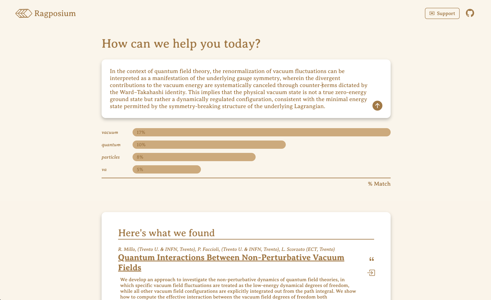

# Ragposium React


[](https://github.com/kyle-tennison/ragposium-react/actions/workflows/trigger-deployment.yml)


React site for [Ragposium](https://ragposium.com).



## Local Development

You can install the site with:

```
npm i
```

Then, to run locally, you can use:

```
npm run dev
```

To make requests, you will need to clone the primary [ragposium](https://github.com/kyle-tennison/ragposium) repo and follow the instructions on local docker spin-up. 

## CI/CD

Deployment is done on the behalf of the primary [ragposium](https://github.com/kyle-tennison/ragposium) repo; each push to the master branch triggers a new deployment. 

Each push to the main branch in this repo will trigger an `Update submodules` commit in the primary repo by the GitHub actions user. This, in turn, automatically deploys any pushes to the main branch of this repo.

## Contributing

If you are interested in contributing, please reach out to me at [kyletennison05@gmail.com](mail:kyletennison05@gmail.com).